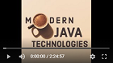

 # Modern Java Technologies (Съвременни Java Технологии) 2024/25
 This repository contains some of my work throughout the MJT course at FMI, 2024/25, winter semester.

## [Course project](https://github.com/darimachine/[Proekt Ime])

## Labs
| # | Topic | Lab task solution |
| - | :---- | :---------------- |
| 01 | Introduction to Java | [Course Scheduler](https://github.com/darimachine/Modern-Java-Technologies-FMI/tree/main/01.%20Introduction%20to%20Java/lab/01-course-scheduler), [Text Justifier](https://github.com/darimachine/Modern-Java-Technologies-FMI/tree/main/01.%20Introduction%20to%20Java/lab/02-text-justifier) |
| 02 | OOP in Java - Part 1 | [GameStore 🎮](https://github.com/darimachine/Modern-Java-Technologies-FMI/tree/main/02.%20OOP%20in%20Java%20-%20Part%201/lab) |
| 03 | OOP in Java - Part 2 | [Vehicle Renting 🚗](https://github.com/darimachine/Modern-Java-Technologies-FMI/tree/main/03.%20OOP%20In%20Java%20-%20Part%202/lab) |
| 04 | Collections and Clean Code | [Social Network 💬](https://github.com/darimachine/Modern-Java-Technologies-FMI/tree/main/04.%20Collections%20and%20Clean%20Code/lab) |
| 05 | Generics | [Event Bus 🔔](https://github.com/darimachine/Modern-Java-Technologies-FMI/tree/main/05.%20Generics/lab) |
| 06 | Unit Testing and Mocking | [MJT Olympics 🏃‍🏊‍🚴‍🏅](https://github.com/darimachine/Modern-Java-Technologies-FMI/tree/main/06.%20Unit%20Testing%20and%20Mocking/lab)|
| 07 | IO Streams and Files | [Photo Edge Detector 🖼️](https://github.com/darimachine/Modern-Java-Technologies-FMI/tree/main/07.%20IO%20Streams%20and%20Files/lab) |
| 08 | Lambdas and Stream API | [Fraud Detector 💳 🕵️‍♂️](https://github.com/darimachine/Modern-Java-Technologies-FMI/tree/main/08.%20Lambdas%20and%20Stream%20API/lab) |
| 09 | Threads | [Sentiment Analyzer 📚](https://github.com/darimachine/Modern-Java-Technologies-FMI/tree/main/09.%20Threads/lab) |
| 10 | Network - Part 2 |[Poll System 📊](https://github.com/darimachine/Modern-Java-Technologies-FMI/tree/main/11.%20Network%20-%20Part%202/lab) |

## Homeworks
| # | Homework solution |
| - | :---------------- |
| 01 | [Glovo 🚚](https://github.com/darimachine/Modern-Java-Technologies-FMI/tree/main/Homeworks/Homework%201) |
| 02 | [Goodreads: Book Recommender 📚](https://github.com/darimachine/Modern-Java-Technologies-FMI/tree/main/Homeworks/Homework%202) |
| 03 | Here to Upload |

---
 For more detailed information about the course, visit the [MJT GitHub repository](https://github.com/fmi/java-course).
# Съвременни Java Технологии @ ФМИ

[График на курса](https://github.com/fmi/java-course/tree/master/docs/00-schedule)

### Лекции и упражнения 2024/2025

| # | Тема | Лекция | Видео | Дата | Упражение | Видео | Дата |
| - | :--- | :----- | :---- | :--- | :-------- | :---- | :--- |
| 1 | Въведение в Java | [слайдове](https://fmi.github.io/java-course/01-intro-to-java/lecture/slides.html) |  | 09.10 | [задача](https://github.com/fmi/java-course/tree/master/01-intro-to-java/lab) |  | 12.10 |
| 2 | ООП с Java (част I) | [слайдове](https://fmi.github.io/java-course/02-oop-in-java-i/lecture/slides.html) |  | 16.10 | [задача](https://github.com/darimachine/Modern-Java-Technologies-FMI/tree/main/02.%20OOP%20in%20Java%20-%20Part%201/lab) |  | 19.10 |
| 3 | ООП с Java (част II) | [слайдове](https://fmi.github.io/java-course/03-oop-in-java-ii/lecture/slides.html) |  | 23.10 | [задача](https://github.com/darimachine/Modern-Java-Technologies-FMI/tree/main/03.%20OOP%20In%20Java%20-%20Part%202/lab) |  | 26.10 |

### Материали от предходни издания

- [2023/2024](https://github.com/fmi/java-course/tree/mjt-2023-2024)
- [2022/2023](https://github.com/fmi/java-course/tree/mjt-2022-2023)
- [2021/2022](https://github.com/fmi/java-course/tree/mjt-2021-2022)
- [2020/2021](https://github.com/fmi/java-course/tree/mjt-2020-2021)
- [2019/2020](https://github.com/fmi/java-course/tree/mjt-2019-2020)
- [2018/2019](https://github.com/fmi/java-course/tree/mjt-2018-2019)
- [2017/2018](https://github.com/fmi/java-course/tree/mjt-2017-2018)
